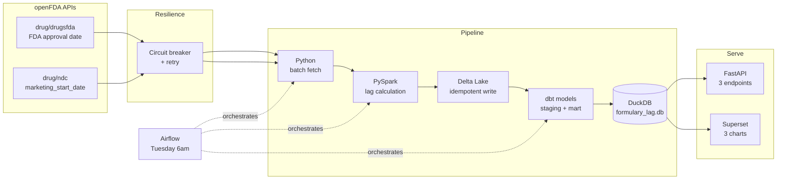
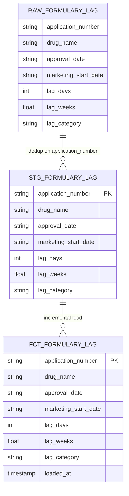
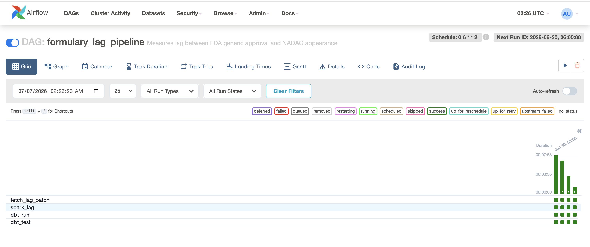
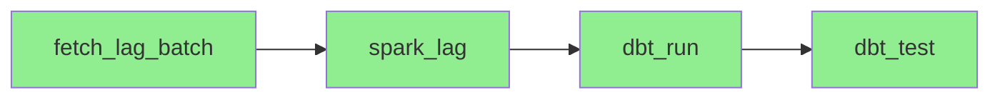
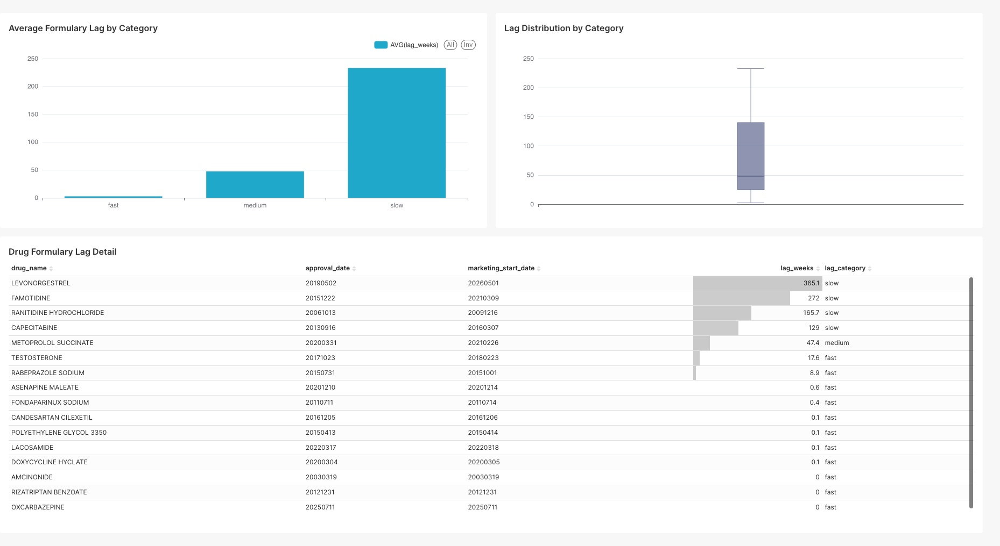

# formulary-lag-detector

When the FDA approves a generic drug, how many weeks before
pharmacies actually start selling it? That gap — the formulary
lag — costs PBMs money. Every week a cheaper generic sits
unapproved in a formulary is a week members pay brand prices.

This pipeline measures that lag for every ANDA approval in
openFDA, categorizes drugs by how long they took to reach
market, and surfaces the worst offenders.

## How it works



## Data strategy

Two openFDA endpoints joined on `application_number`:

- `drug/drugsfda` → original submission approval date (ORIG, status AP)
- `drug/ndc` → `marketing_start_date` (when pharmacies began selling)
- Lag = `marketing_start_date` minus `approval_date` in weeks

Both endpoints use the same API key and return consistent
date formats. No NADAC file scanning needed — openFDA already
has the marketing start date directly on the NDC record.

Data quality filters applied:

- Skip drugs with no NDC record (no marketing_start_date)
- Skip negative lags (data error — marketed before approval date)
- Skip lags over 3,650 days (10 years) — new NDC registrations
  on old drugs, not genuine first-to-market lags

## Resilience

Circuit breaker and retry are built in from day 1 — not
added after the first failure like in a previous project.

Every openFDA API call goes through:

1. **Retry** (3 attempts, exponential backoff + jitter) —
   handles transient failures like network blips
2. **Circuit breaker** (trips after 3 failures, 60s cooldown)
   — stops hammering a struggling API, backs off entirely

One circuit breaker is shared across both endpoints so if
openFDA is struggling, both drugsfda and ndc calls back off
together rather than independently.

## HIPAA patterns

The pipeline doesn't use real PHI. The `hipaa/` module
demonstrates 5 Safe Harbor patterns on Faker-generated
synthetic member records:

1. **Masking at ingestion** — name dropped, DOB → age group
   (decade bands), zip → first 3 digits only
2. **Encryption at rest** — AES-256 key derivation from
   secret + salt via HMAC-SHA256 (secret from secrets manager
   in production, never hardcoded)
3. **Audit logging** — every PHI access logged with requester,
   timestamp, record count, and purpose
4. **Data minimization** — only fields needed for the analysis
   survive the ingestion step
5. **Safe aggregation** — groups under 11 members suppressed
   per HIPAA Safe Harbor (never report small cohorts)

## dbt models



`stg_formulary_lag` deduplicates the raw Delta Lake parquet
files (multiple files accumulate from MERGE operations).
`fct_formulary_lag` is incremental — only new
`application_number` values are added on each run.

## Airflow orchestration





Scheduled Tuesday 6am — one day after NADAC's Monday weekly
refresh. Each task retries 3 times with a 5-minute delay
before failing.

## Dashboard



Three charts on `fct_formulary_lag`:

1. **Average lag by category** — fast: 2.5 weeks, medium:
   47.4 weeks, slow: 233 weeks average
2. **Lag distribution** — median 47.4 weeks, wide spread
   (Q1: 25 to Q3: 140 weeks), max 365 weeks
3. **Drug detail table** — LEVONORGESTREL at 365.1 weeks
   (7 years), FAMOTIDINE 272 weeks, RANITIDINE 165.7 weeks

## API

```bash
uvicorn api.main:app --reload --port 8000
```

Interactive docs at `http://localhost:8000/docs`.

- `GET /drugs/{application_number}/lag` — lag for a specific
  ANDA application
- `GET /drugs/avg-lag-by-category` — fast/medium/slow averages
- `GET /drugs/slow-to-market?min_weeks=78` — drugs above a
  lag threshold (default 78 weeks)

## Running locally

### Requirements

- Python 3.11+
- Java 17 (required by PySpark)

### Setup

```bash
git clone https://github.com/lohitha-bhethalam/formulary-lag-detector.git
cd formulary-lag-detector
pip install -r requirements.txt
```

### Run the pipeline

```bash
python3 -m ingest.fetch_lag_batch   # fetch from openFDA
python3 spark_lag.py                # PySpark + Delta Lake
cd dbt && dbt run && dbt test       # dbt models
```

### Run with Docker

```bash
docker build -t formulary-lag-detector .
docker run --rm -v $(pwd)/data:/app/data formulary-lag-detector
```

### Run the API

```bash
uvicorn api.main:app --reload --port 8000
```

## Setup guide for new developers

### Prerequisites

Make sure you have the following installed before starting:

- Python 3.11+
- Java 17 (required by PySpark) — install via `brew install openjdk@17`
- Docker Desktop
- Git

### Step 1 — Clone and install dependencies

```bash
git clone https://github.com/lohitha-bhethalam/formulary-lag-detector.git
cd formulary-lag-detector
pip install -r requirements.txt
```

### Step 2 — Run the pipeline locally

```bash
# Fetch lag batch from openFDA APIs
python3 -m ingest.fetch_lag_batch

# Run PySpark pipeline — writes to Delta Lake
python3 spark_lag.py

# Load Delta Lake output into DuckDB and run dbt models
python3 -c "
import duckdb, glob
conn = duckdb.connect('data/formulary_lag.db')
conn.execute(\"\"\"
    CREATE OR REPLACE TABLE raw_formulary_lag AS
    SELECT * FROM read_parquet('data/delta/formulary_lag/*.parquet')
\"\"\")
conn.close()
"
cd dbt && dbt run && dbt test
```

### Step 3 — Or run everything in Docker

```bash
docker build -t formulary-lag-detector .
docker run --rm -v $(pwd)/data:/app/data formulary-lag-detector
```

### Step 4 — Start the API

```bash
uvicorn api.main:app --reload --port 8000
# Swagger UI at http://localhost:8000/docs
```

### Step 5 — Start the dashboard

```bash
export FLASK_APP=superset
export SUPERSET_CONFIG_PATH=~/.superset/superset_config.py
superset run -p 8088 --with-threads --reload
# UI at http://localhost:8088 — login: admin / admin
# Connect to data/formulary_lag.db via DuckDB driver
```

### Step 6 — Run the Airflow DAG

```bash
pip install apache-airflow
export AIRFLOW_HOME=$(pwd)/airflow
airflow db init
airflow users create \
  --username admin --firstname Admin --lastname User \
  --role Admin --email admin@example.com --password admin
airflow scheduler &
airflow webserver --port 8080
# DAG: formulary_lag_pipeline — trigger manually or wait
# for Tuesday 6am schedule
```

## Data sources

| Source | What it contains | Where |
| --- | --- | --- |
| openFDA drugsfda | FDA approval dates per ANDA | api.fda.gov |
| openFDA NDC | Marketing start dates | api.fda.gov |

## Data privacy

All data used in this project is publicly available via
openFDA. No patient data, PHI, or PII is used or stored.
The `hipaa/` module uses only Faker-generated synthetic
records — no real member data.
